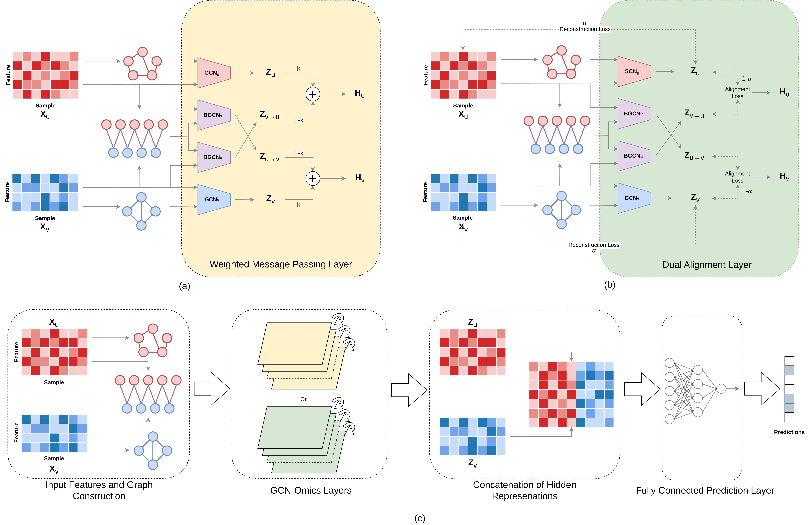

# GCN-Omics

This repository contains the code for GCN-Omics, a multi-omics integration model that utilizes Graph Convolution Networks for the downstream task of disease classification. The model uses separate and parallel GCNs to learn the intra-omics and inter-omics interactions.

## Overall Framework


## How To Run

First, install the dependencies using the requirements.txt file. It is recommended to create a python virtual environment first.
> pip install -r requirements.txt

### Input Data
The model primarily uses two omics data, Gene Expression and miRNA Expression. There is a set of sample data in the "sample_data" directory. The directory has separate train, validation and test files for both of the omics. The files are organized into *(sample x value)* manner. There are also separate label files for train, validation and test data. The labels are 0-indexed and structured in a 1-D array. To run successfully, the number of samples in each train, validation or test data should be same. The bipartite graph is stored in "bip.csv", which is structured into *(omic1 features x omic2 features)*. *(The "1" in the data files denote split number, since we split the data 100 times for training. Here, we give one sample)*

### Dual Alignment
To run the model with Dual Alignment module, go to the directory "DA".
> cd DA

Then run the train file, using
>python train.py

The model is flexible to be trained with different hyper-parameter setting. The hyper-parameters are:

```num_layers``` : Number of GCN-Omics layer <br>
```batch_size``` : Batch Size for the input data <br>
```gcn_epochs``` : Number of epochs for the pretraining of the GCN-Omics layers <br>
```epochs``` : Number of layers to train the model end-to-end <br>
```lr``` : Learning Rate <br>
```hidden_dim``` : Hidden representation dimension <br>
```adj_thresh``` : Adjacency matrix threshold for the intra-omics graph <br>
```alpha``` : Weight for the Alignment loss (it should be within the range [0, 1]) <br>
```bias``` : Enable training bias <br>
```split``` : Number of split to train on <br>
```data_path``` : Input data directory <br>
```save_path``` : Directory to store the results <br>
```save_filename``` : Name of the csv file to store the results <br>

To train with different hyper-parameter setting, train using
>`python train.py --<hyper-parameter>=<value>`

### Weighted Message Passing
To run the model with Dual Alignment module, go to the directory "WMP".
>cd WMP

Then run the train file, using
>python train.py

The model is flexible to be trained with different hyper-parameter setting. The hyper-parameters are:

```num_layers``` : Number of GCN-Omics layer <br>
```batch_size``` : Batch Size for the input data <br>
```k``` : Weight for the intra-omics data (it should be within the range [0, 1]) <br>
```epochs``` : Number of layers to train the model end-to-end <br>
```lr``` : Learning Rate <br>
```hidden_dim``` : Hidden representation dimension <br>
```adj_thresh``` : Adjacency matrix threshold for the intra-omics graph <br>
```alpha``` : Weight for the Alignment loss (it should be within the range [0, 1]) <br>
```bias``` : Enable training bias <br>
```split``` : Number of split to train on <br>
```data_path``` : Input data directory <br>
```save_path``` : Directory to store the results <br>
```save_filename``` : Name of the csv file to store the results <br>

To train with different hyper-parameter setting, train using
>`python train.py --<hyper-parameter>=<value>`