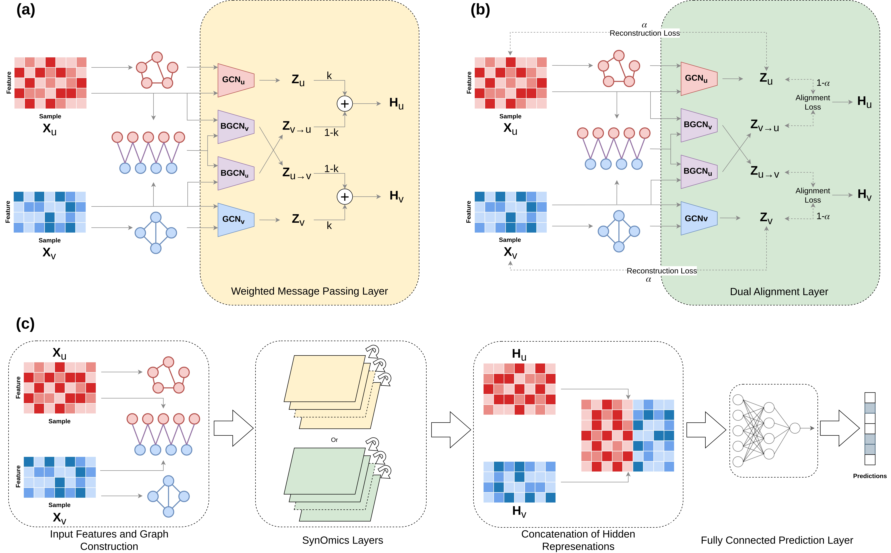
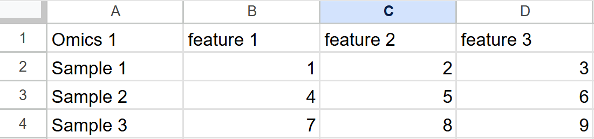
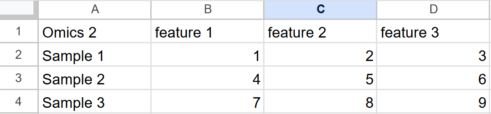
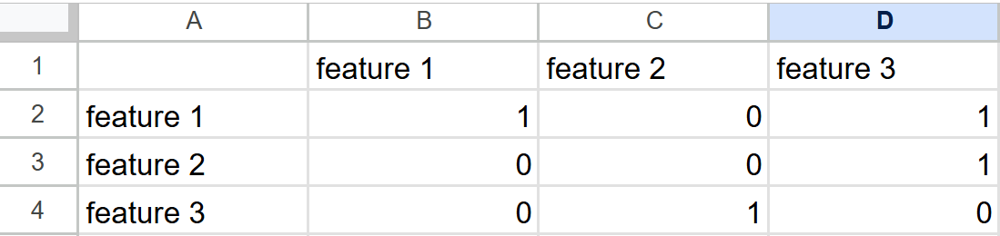
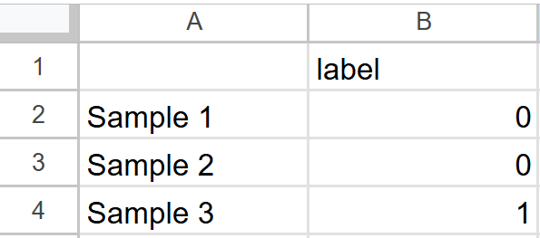

# SynOmics

This repository contains the code for SynOmics, a multi-omics integration model that utilizes Graph Convolution Networks for the downstream task of disease classification. The model uses separate and parallel GCNs to learn the intra-omics and inter-omics interactions.

## Overall Framework


## How To Run

First, install the dependencies using the requirements.txt file. It is recommended to create a python virtual environment first.
```bash
pip install -r requirements.txt
```

### Input Data

All input data are in csv format.

<b>Omics Data</b>: Omics datasets should be in *(sample x feature)* format with first column being the names of the samples and first row being names of the features. Example images of omics data are attached below.

<div align="center">
    
    
</div>

<b>Bipartite Graphs</b>: The bipartite graphs should be in *(omic1 features x omic2 features)* format with first column being the names of the features of omic1 and first row being names of the features of omic2. Example images of a bipartite graph are attached below.

<div align="center">
    
</div>

<b>Labels</b>: The labels should be in *(sample x 1)* format with first column being the names of the samples. Example images of labels are attached below.

<div align="center">
    
</div>

The model primarily utilizes two types of omics data: mRNA Expression and miRNA Expression. It can also be extended to incorporate any number of omics data type. Here, we use DNA Methylation as the third omics type. There is a set of sample data from the TCGA Breast Cancer (BRCA) for the Estrogen Receptor (ER) label in the "sample_data" directory. The directory contains <br>
1. Input data for mRNA expression in a csv file. 
2. Input data for miRNA expression in a csv file.
3. Input data for DNA methylation in a csv file. 
4. mRNA-miRNA dipartite graph, miRNA-DNA_Methylation and DNA-Methylation bipartite graphs in "bip" deirecotry. For three omics, the bipartite graphs should be delcared in a cyclic order, i.e. omic1-omic2, omic2-omic3 and omic3-omic1. Here we consider mRNA expression as omic1, miRNA expression as omic2, and DNA Methylation as omic3. <br>

***[Please note that the data provided here is a sample intended for demonstration purposes only, based on one split out of one hundred, for a single target label among many. This sample may not be sufficient to reproduce the results in the paper.]***


### Dual Alignment
To run the model with Dual Alignment module (with 2 omics) with the sample data, run the following command:
```bash
python DA/train.py --mRNA_path=sample_data/mRNA.csv --miRNA_path=sample_data/miRNA.csv --label_path=sample_data/label.csv --bip_path=sample_data/bip/bip_mRNA_miRNA.csv
```

The model is flexible to be trained with different hyper-parameter settings. The hyper-parameters are:

| **Parameter**       | **Description**                                                                                                      |
|---------------------|----------------------------------------------------------------------------------------------------------------------|
| `num_layers`        | Number of SynOmics layers                                                                                           |
| `batch_size`        | Batch size for the input data                                                                                        |
| `gcn_epochs`        | Number of epochs for the pretraining of the SynOmics layers                                                          |
| `epochs`            | Number of layers to train the model end-to-end                                                                       |
| `lr`                | Learning rate                                                                                                        |
| `hidden_dim`        | Hidden representation dimension                                                                                      |
| `adj_thresh`        | Adjacency matrix threshold for the intra-omics graph (must be within the range [0, 1]. A higher value makes the graph sparser) |
| `alpha`             | Weight for the reconstruction loss (must be within the range [0, 1])                                                 |
| `bias`              | Enable training with bias (True or False)                                                                             |
| `mRNA_path`          | Path to the mRNA csv file                                                                                  |
| `miRNA_path`         | Path to the miRNA csv file                                                                                  |
| `label_path`         | Path to the label csv file                                                                                  |
| `bip_path`          | Path to the bipartite graph file                                                                                      |
| `task`          | Select the task to perform: 'class' generates classification results, while 'emb' generates embeddings.                                                                                      |


To train with different hyper-parameter settings, train using
```bash
python train.py --<hyper-parameter1>=<value> --<hyper-parameter2>=<value> ...
```

### Weighted Message Passing
To run the model with Weighted Message Passing module (with 2 omics) with the sample data, run the following command:
```bash
python WMP/train.py --mRNA_path=sample_data/mRNA.csv --miRNA_path=sample_data/miRNA.csv --label_path=sample_data/label.csv --bip_path=sample_data/bip/bip_mRNA_miRNA.csv
```

The model is flexible to be trained with different hyper-parameter settings. The hyper-parameters are:

| **Parameter**       | **Description**                                                                                                      |
|---------------------|----------------------------------------------------------------------------------------------------------------------|
| `num_layers`        | Number of SynOmics layers                                                                                           |
| `batch_size`        | Batch size for the input data                                                                                        |
| `k`                 | Weight for the intra-omics data (must be within the range [0, 1])                                                     |
| `epochs`            | Number of layers to train the model                                                                                  |
| `lr`                | Learning rate                                                                                                        |
| `hidden_dim`        | Hidden representation dimension                                                                                      |
| `adj_thresh`        | Adjacency matrix threshold for the intra-omics graph (must be within the range [0, 1]. A higher value makes the graph sparser) |
| `bias`              | Enable training with bias (True or False)                                                                             |
| `mRNA_path`          | Path to the mRNA csv file                                                                                  |
| `miRNA_path`         | Path to the miRNA csv file                                                                                  |
| `label_path`         | Path to the label csv file                                                                                  |
| `bip_path`          | Path to the bipartite graph file                                                                                      |
| `task`          | Select the task to perform: 'class' generates classification results, while 'emb' generates embeddings.                                                                                      |


To train with different hyper-parameter settings, train using
```bash
python train.py --<hyper-parameter1>=<value> --<hyper-parameter2>=<value> ...
```

### Extended Model of 3 Omics
To run the model extended for 3 omics on the sample data, run the following command:
```bash
python 3_Omics/train.py --mRNA_path=sample_data/mRNA.csv --miRNA_path=sample_data/miRNA.csv --DNA_Meth_path=sample_data/DNA_Meth.csv --label_path=sample_data/label.csv --bip12_path=sample_data/bip/bip_mRNA_miRNA.csv --bip23_path=sample_data/bip/bip_miRNA_DNA_Meth.csv --bip31_path=sample_data/bip/bip_DNA_Meth_mRNA.csv
```

The model is flexible to be trained with different hyper-parameter settings. The hyper-parameters are:

| **Parameter**       | **Description**                                                                                                      |
|---------------------|----------------------------------------------------------------------------------------------------------------------|
| `num_layers`        | Number of SynOmics layers                                                                                           |
| `batch_size`        | Batch size for the input data                                                                                        |
| `k1`                | Weight for the contribution of the first inter-omics data (must be within the range [0, 1])                           |
| `k2`                | Weight for the contribution of the second inter-omics data (must be within the range [0, 1])                          |
| `epochs`            | Number of layers to train the model                                                                                  |
| `lr`                | Learning rate                                                                                                        |
| `hidden_dim`        | Hidden representation dimension                                                                                      |
| `adj_thresh`        | Adjacency matrix threshold for the intra-omics graph (must be within the range [0, 1]. A higher value makes the graph sparser) |
| `bias`              | Enable training with bias (True or False)                                                                             |
| `mRNA_path`          | Path to the mRNA csv file                                                                                  |
| `miRNA_path`         | Path to the miRNA csv file                                                                                  |
| `DNA_Meth_path`      | Path to the DNA Methylation data                                                                         |
| `label_path`         | Path to the label csv file                                                                                  |
| `bip12_path`         | Path to the bipartite graph between omic1 and omic2 csv file                                                                                |
| `bip23_path`         | Path to the bipartite graph between omic2 and omic1 csv file                                                                               |
| `bip31_path`         | Path to the bipartite graph between omic3 and omic1 csv file                                                                                |
| `task`          | Select the task to perform: 'class' generates classification results, while 'emb' generates embeddings.                                                                                      |


To train with different hyper-parameter settings, train using
```bash
python train.py --<hyper-parameter1>=<value> --<hyper-parameter2>=<value> ...
```
