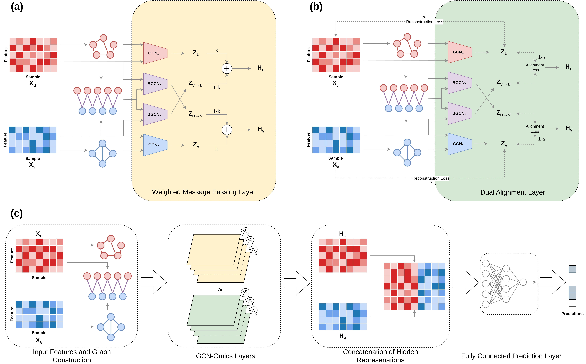

# GCN-Omics

This repository contains the code for GCN-Omics, a multi-omics integration model that utilizes Graph Convolution Networks for the downstream task of disease classification. The model uses separate and parallel GCNs to learn the intra-omics and inter-omics interactions.

## Overall Framework


## How To Run

First, install the dependencies using the requirements.txt file. It is recommended to create a python virtual environment first.
```bash
pip install -r requirements.txt
```

### Input Data
The model primarily utilizes two types of omics data: Gene Expression and miRNA Expression. It can also be extended to incorporate any number of omics data type. Here, we use DNA Methylation as the third omics type. There is a set of sample data from the TCGA Breast Cancer (BRCA) for the Estrogen Receptor (ER) label in the "sample_data" directory. The directory contains <br>
1. Separate train, validation and test files for each of the omics. The files are organized into *(sample x value)* manner. <br>
2. Separate label files for train, validation and test data. The labels are 0-indexed and structured in a 1-D array of samples. <br>
3. The bipartite graphs stored in "bip_{omic1}_{omic2}.pkl" files, which are structured into *(omic1 features x omic2 features)* manner. The omics are named "gene_exp", "miRNA" and "DNA_Meth" respectively. <br>

To run successfully, the number of samples in each train, validation or test data must be the same.  *(The "1" in the data files denote split number, as we split the data 100 times for training. Here, we give one sample)*

### Dual Alignment
To run the model with Dual Alignment module with the sample data, run the following command:
```bash
python DA/train.py --data_path=sample_data
```

The model is flexible to be trained with different hyper-parameter settings. The hyper-parameters are:

```num_layers``` : Number of GCN-Omics layers <br>
```batch_size``` : Batch size for the input data <br>
```gcn_epochs``` : Number of epochs for the pretraining of the GCN-Omics layers <br>
```epochs``` : Number of layers to train the model end-to-end <br>
```lr``` : Learning rate <br>
```hidden_dim``` : Hidden representation dimension <br>
```adj_thresh``` : Adjacency matrix threshold for the intra-omics graph (must be within the range [0, 1]. A higher value makes the graph sparser) <br>
```alpha``` : Weight for the reconstruction loss (must be within the range [0, 1]) <br>
```bias``` : Enable training with bias (True or False) <br>
```split``` : Number of split to train on <br>
```data_path``` : Input data directory <br>

To train with different hyper-parameter settings, train using
```bash
python train.py --<hyper-parameter1>=<value> --<hyper-parameter2>=<value> ...
```

### Weighted Message Passing
To run the model with Weighted Message Passing module with the sample data, run the following command:
```bash
python WMP/train.py --data_path=sample_data
```

The model is flexible to be trained with different hyper-parameter settings. The hyper-parameters are:

```num_layers``` : Number of GCN-Omics layers <br>
```batch_size``` : Batch size for the input data <br>
```k``` : Weight for the intra-omics data (must be within the range [0, 1]) <br>
```epochs``` : Number of layers to train the model <br>
```lr``` : Learning rate <br>
```hidden_dim``` : Hidden representation dimension <br>
```adj_thresh``` : Adjacency matrix threshold for the intra-omics graph (must be within the range [0, 1]. A higher value makes the graph sparser) <br>
```bias``` : Enable training with bias (True or False) <br>
```split``` : Number of split to train on <br>
```data_path``` : Input data directory <br>

To train with different hyper-parameter settings, train using
```bash
python train.py --<hyper-parameter1>=<value> --<hyper-parameter2>=<value> ...
```

### Extended Model of 3 Omics
To run the model with 3 omics data on the sample data, run the following command:
```bash
python 3_Omics/train.py --data_path=sample_data
```

The model is flexible to be trained with different hyper-parameter settings. The hyper-parameters are:

```num_layers``` : Number of GCN-Omics layers <br>
```batch_size``` : Batch size for the input data <br>
```k1``` : Weight for the contribution of the first inter-omics data  (must be within the range [0, 1]) <br>
```k2``` : Weight for the contribution of the second inter-omics data (must be within the range [0, 1]) <br>
```epochs``` : Number of layers to train the model <br>
```lr``` : Learning rate <br>
```hidden_dim``` : Hidden representation dimension <br>
```adj_thresh``` : Adjacency matrix threshold for the intra-omics graph (must be within the range [0, 1]. A higher value makes the graph sparser) <br>
```bias``` : Enable training with bias (True or False) <br>
```split``` : Number of split to train on <br>
```data_path``` : Input data directory <br>

To train with different hyper-parameter settings, train using
```bash
python train.py --<hyper-parameter1>=<value> --<hyper-parameter2>=<value> ...
```
